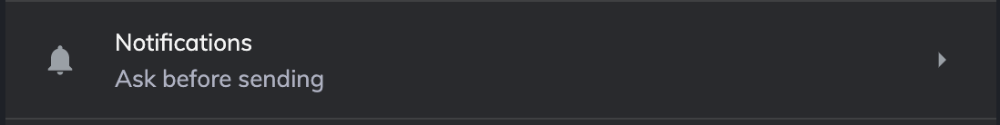

build-lists: true

# Notifications API

Jordan Cooperman

Twitter: @jordantomax
Email: jordancooperman@gmail.com

---
[.text: alignment(center)]

# Our Browser has Superpowers 💪


whatwebcando.today

---

# Notifications API


---

# Notifications API Outline

1. Local notifications
2. Service workers
3. Subscriptions

---

# Notifications API Outline

1. 👉 **Local notifications** 👈
2. Service workers
3. Subscriptions

---

# Local Notifications Example

1. Request permission
2. Show notification

---

# 1. Request permission

```javascript
const permission = await Notification.requestPermission()
// possible results are "default", "granted", "denied"
```


---

# 2. Show notification

Assuming the user has granted permission

```javascript
  new Notification('Much JavaScript')
```


---

# Once the user chooses, permissions disappear


---
[.text: alignment(center)]

We can't access edit permissions via API for security. The user must edit them in the deep dark place, way, way down, within your browser settings.

👇

👇

👇


---

# Notifications API Outline

1. 👉 **Local notifications** 👈
2. Service workers
3. Subscriptions

---

# Notifications API Outline

1. Local notifications
2. 👉 **Service workers** 👈
3. Subscriptions

---

# Service workers

Those things you've seen but haven't seen


---

# Create React App Comes with One


---

# What are service workers?

Service workers are .js files that run on separate threads to receive push messages from a server (even when app is inactive), proxy network requests, etc.

## Getting started

1. Register the worker 👷‍♀️ 👷‍♂️
2. Harness the power 🐲 👊

---

# 1. Register the Worker 👷‍♀️ 👷‍♂️

```javascript
// app.js
async function registerServiceWorker () {
  const sw = await navigator.serviceWorker.register('/service.js')
  return sw
}

// public/service.js
// WE'RE LITERALLY DOING PUBLIC SERVICE IN THIS ROOM RIGHT NOW FOLKS!
console.log('hello from the service worker!')
```

---

# Confirm registration


---

# 2. Harness the power 🐲 👊

Prepare for the push

```javascript
// service.js
console.log('Hello from service worker!')

self.addEventListener('push', function (e) {
  self.registration.showNotification('Much JavaScript')
})
```

---

# Send it a test


---

# Notifications API Outline

1. Local notifications
2. 👉 **Service workers** 👈
3. Subscriptions

---

# Notifications API Outline

1. Local notifications
2. Service workers
3. 👉 **Subscriptions** 👈

---

# 3. Subscriptions

1. Create server to save subscription and send push
2. Subscribe to push events from service worker

---

# This is a React meetup, so let's add a convenient wrapper with React

---

# Browser support

We need both Service worker support and push notification support!


---


# To summarize

- Test user facing behavior (i.e. text, style that is visible to the user)
- Write unit tests to test general use cases
- Use contract tests to make large changes less scary
- Use factories where there is structured data
- Use factories to create consistent contracts

---

# Tools and Resources

https://github.com/jordantomax/talks/tree/master/testing-functional-components
https://github.com/stalniy/bdd-lazy-var
https://github.com/rosiejs/rosie
https://github.com/marak/Faker.js/
https://github.com/testing-library/react-testing-library https://kentcdodds.com/blog/testing-implementation-details
https://martinfowler.com/bliki/ContractTest.html

---

# Thank you

@jordantomax
jordan@kobee.io
kobee.io
