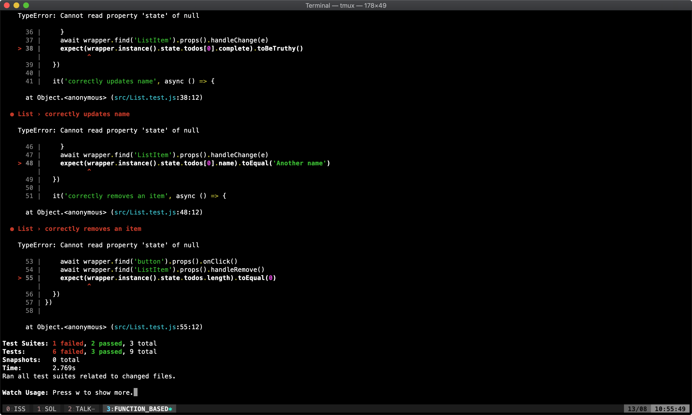
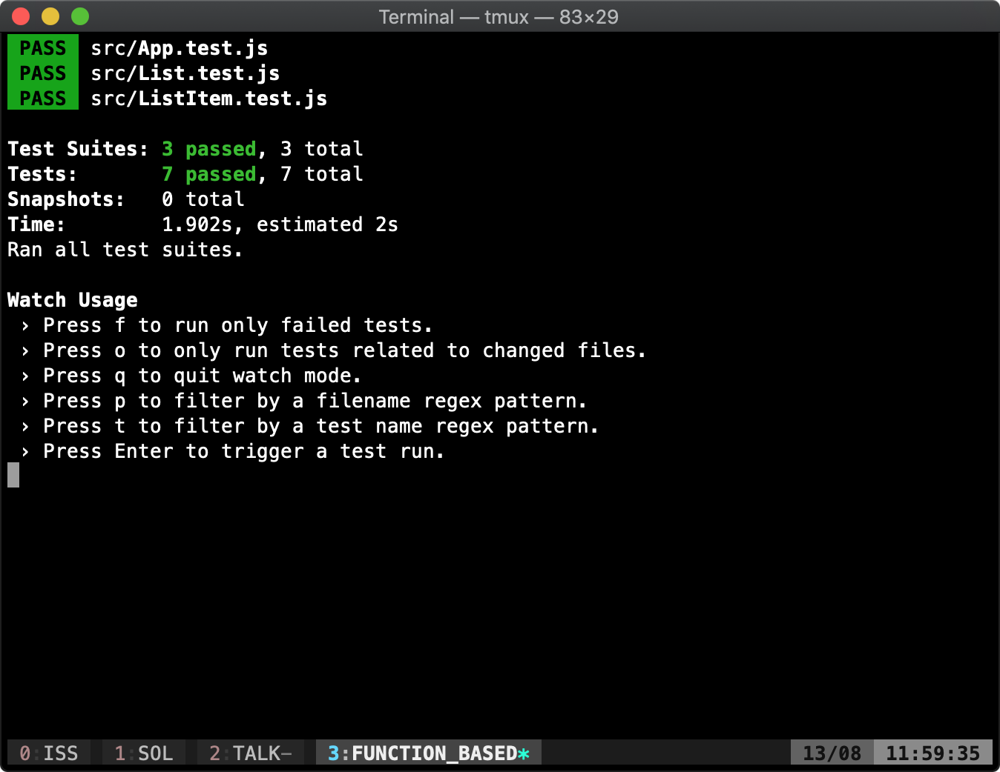
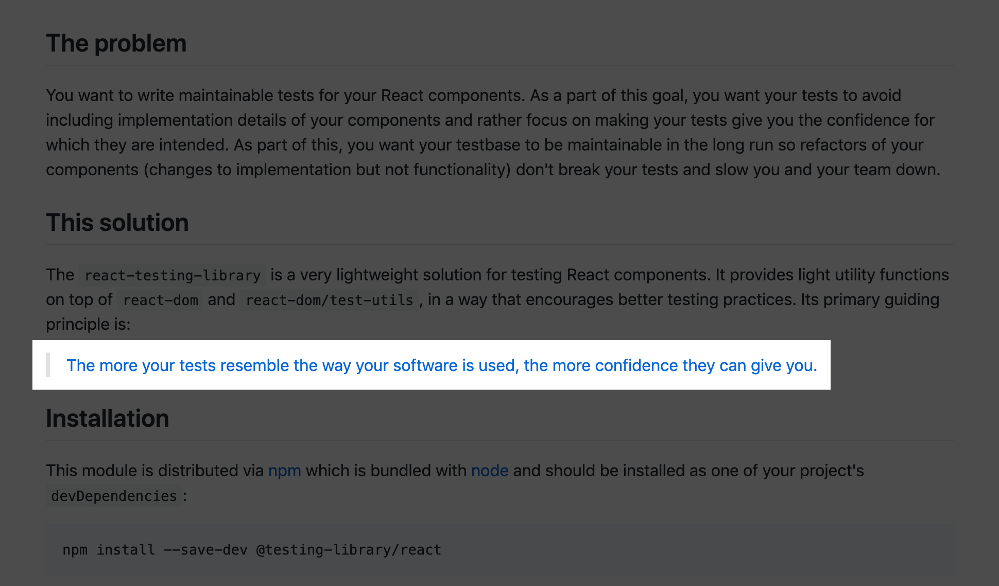
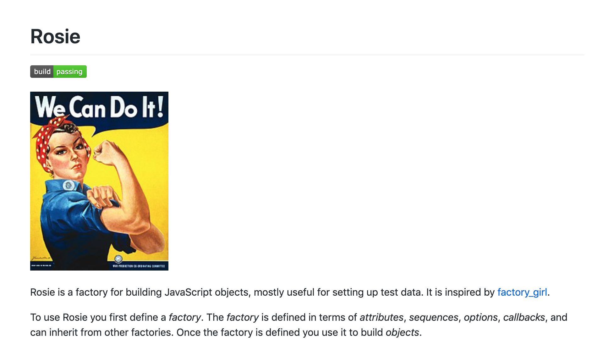

build-lists: true

# Testing Functional React Components

### A journey from Enzyme to React Testing Library

Jordan Cooperman

Twitter: @jordantomax
Email: jordan@kobee.io

---


# Being a JavaScript programmer is like being a dog

---

# jQuery

A little here, a little there


---

# Backbone

kind of organized?


---

# Angular

Full framework, opinionated and complicated


---

# React

Simple, flexible, encapsulated


[^1]: Galina Savina(Shutterstock.com)

---

# Unit testing with React is easy

---

# Code coverage

- 90%?
- 70%?
- 50%?
- Don’t know?

---

# Let's write some bad tests!

---

```javascript
class List extends React.Component {
  todoCreate (e) { ... }
  handleChange (e, i) { ... }
  handleRemove (i) { ... }

  render () {
    return (
      <div>
        <button onClick={this.todoCreate}>Add a todo</button>

        <ul>
          {this.state.todos.map((todo, i) => {
            return <ListItem
                handleChange={(e) => this.handleChange(e, i)}
                handleRemove={() => this.handleRemove(i)}
                key={i}
                todo={todo}
              />
          })}
        </ul>
      </div>
    )
  }
}
```

---
[.code-highlight: all]
[.code-highlight: 6]
[.code-highlight: 7]
[.code-highlight: 8]

```javascript
describe('List', () => {

  // ...

  it('adds a todo when clicking add', async () => {
    const wrapper = shallow(<List />)
    await wrapper.find('button').props().onClick()
    expect(wrapper.instance().state.todos.length).toEqual(1)
  })

  // ...

})
```

---

# What happens if we re-write the component with the latest React hotness?

---

```javascript
function List () {
  const [todos, setTodos] = React.useState([])

  function create (e) { ... }
  function handleChange (e, i) { ... }
  function handleRemove (i) { ... }

  return (
    <div>
      <button onClick={create}>Add a todo</button>

      <ul>
        {todos.map((todo, i) => {
          return (
            <ListItem
              handleChange={(e) => handleChange(e, i)}
              handleRemove={() => handleRemove(i)}
              key={i}
              todo={todo}
            />
          )
        })}
      </ul>
    </div>
  )
}
```

---



---

# :(

TODO charlie brown is sad image

---
[.code-highlight: all]
[.code-highlight: 8]


```javascript
describe('List', () => {

  // ...

  it('adds a todo when clicking add', async () => {
    const wrapper = shallow(<List />)
    await wrapper.find('button').props().onClick()
    expect(wrapper.find('ListItem').length).toEqual(1)
  })

  // ...

})
```

---

# :) ?

TODO excited image



---

# No, still :(

- Shallow render not explicit in what is not rendered
- Calling a method from props does not mirror user behavior
- 'ListItem' is a developer defined named which does not appear in the dom

---

# What to do?

- Mock explicitly instead of shallow rendering
- Trigger an actual click event instead of calling onClick directly
- Look at the actual DOM instead of developer defined names

---

# Let's write better tests

---



https://github.com/testing-library/react-testing-library

---
[.code-highlight: all]
[.code-highlight: 6]
[.code-highlight: 7]
[.code-highlight: 8]


```javascript
describe('List', () => {

  // ...

  it('adds a todo when clicking add', async () => {
    const wrapper = render(<List />)
    act(() => { fireEvent.click(wrapper.getByText('Add a todo')) })
    expect(wrapper.container.querySelector('li')).not.toBeNull()
  })

  // ...

})
```

---

# Much better!

---

# Let's also test specifics of the ListItem

Clicking the name toggles editing

---

```javascript
import ListItem from './ListItem'

describe('ListItem', () => {
  it('shows an input to edit when clicking name', async () => {
    const props = {
      handleChange: jest.fn(),
      todo: {
        name: 'todo',
        complete: false
      }
    }
    const wrapper = render(<ListItem {...props} />)
    await act(async () => fireEvent.click(wrapper.container.querySelector('li > span')))
    expect(wrapper.getByPlaceholderText('Edit todo')).toBeDefined()
  })
})
```

---

# We can do better with factories

Wherever there is structured data, there should be factories



---

# Define the data structure

```javascript
function randomFromArray (array) {
  return array[Math.floor(Math.random() * array.length)]
}

Factory.define('todo')
  .attr('name', () => faker.lorem.word())
  .attr('complete', () => randomFromArray([true, false]))
```

---
[.code-highlight: all]
[.code-highlight: 7]

# Use the factory

```javascript
import ListItem from './ListItem'

describe('ListItem', () => {
  it('shows an input to edit when clicking name', async () => {
    const props = {
      handleChange: jest.fn(),
      todo: Factory.build('todo')
    }
    const wrapper = render(<ListItem {...props} />)
    await act(async () => fireEvent.click(wrapper.container.querySelector('li > span')))
    expect(wrapper.getByPlaceholderText('Edit todo')).toBeDefined()
  })
})
```

---


https://twitter.com/rauchg/status/807626710350839808

---

# Contract tests with factories

Using standard interfaces to create consistent failure in cases where services change

(Martin Fowler explains contract tests well https://martinfowler.com/bliki/ContractTest.html)

## Example: Router

---

# With React Router

We're using React Router, but we may switch in the future.

(Just an example, I <3 React Router!)

Let's write tests to ensure that our tests fail when the shape of our router changes

---

# The component

```javascript
import { withRouter } from 'react-router'

function List ({ history }) {
  function goBack () { ... }

  // This is a small piece of the List component
  // Which will be wrapped in the withRouter HOC

  return (
    <button onClick={goBack}>
      Go back
    </button>
  )
}

export default withRouter(List)
```

---
[.code-highlight: all]
[.code-highlight: 13]

# The test

```javascript
jest.mock('react-router', () => ({
  withRouter: Component => Component
}))

Factory.define('withRouter')
  .attr('history', () => ({
    goBack: jest.fn()
  }))

describe('List', () => {
  it('correctly goes back', async () => {
    const props = {
      ...Factory.build('withRouter')
    }
    const wrapper = render(<List {...props} />)
    await act(async () => fireEvent.click(wrapper.getByText('Go back')))
    expect(props.history.goBack).toHaveBeenCalled()
  })
})
```

---

# Now changing our router isn't so scary

We can change the shape of the withRouter factory, which would cause all of our tests to fail.

This gives us confidence in making decisions like replacing a library.

---

# To summarize

- Test user facing behavior (i.e. text, style that is visible to the user)
- Write unit tests to test general use cases
- Use contract tests to make large changes less scary
- Use factories where there is structured data
- Use factories to create consistent contracts

---

Outro


# References

https://kentcdodds.com/blog/testing-implementation-details
https://testing-library.com
https://martinfowler.com/articles/mocksArentStubs.html
https://martinfowler.com/bliki/ContractTest.html
https://stackoverflow.com/questions/3459287/whats-the-difference-between-a-mock-stub/17810004#17810004
