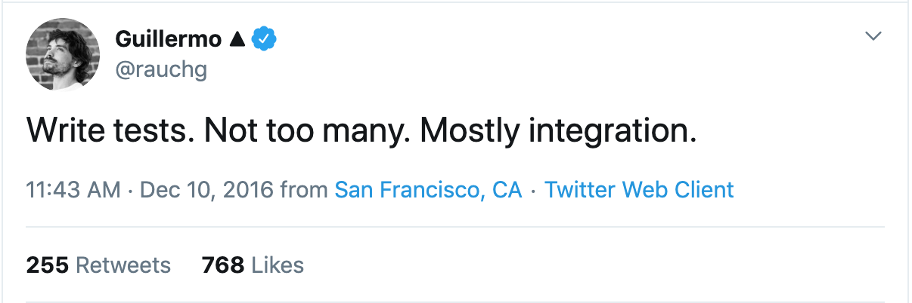

build-lists: true

# Testing Functional React Components

Jordan Cooperman
@jordantomax
jordan@kobee.io

---


# Being a JavaScript programmer is like being a dog

---

# jQuery

spaghetti

---

# Backbone

spaghetti wrapped around a flagpole

---

# Angular

Powerful, opinionated, complicated

---

# React

Encapsulated, simple, incredibly easy to unit test

---



---

# Code coverage


- 90%?
- 70%?
- 50%?
- Don’t know?

---

React hooks have exploded onto the scene, making functional components increasingly attractive. But how do you test them? Unlike class-based components, functional components have no accessible instance. It's a blessing in disguise that forces us to test what's user facing. The next time you change implementation, your tests should pass.

Lead you through my journey with JavaScript testing and explain why I’m like OMG JavaScript testing

Write more tests, write integration tests. Look for the tweet, Kent responded that’s says write fewer tests

I feel like JavaScript years are the equivalent of dog years. We’ve lived like 4 whole lifetimes seeing the evolution from jQuery to Backbone to Angular to React. Each step of the way the code has become more compartlmentalized and more testable.

Hooks are the creme de la creme of testable logic, which is why I’ve decided to talk about testing.

I started testing my react components about a year and a half ago when enzyme was in fashion (funny picture)

Until about 3 months ago, my tests looked like this

CODE

And then hooks were released, and the whole world was like hooked (funny picture)

I started adding some to my app, and in the process concerting class based components to functional components. And then my tests were all like nope.

This is when I realized intuitively why Kent C Dodds is so keen to say do not test implementation.

CODE

I started converted my tests to use the react testing library like a good JavaScript developer and all began to be well with the world. As I converted my components, tests still passed. Sweet.

But there were still some problems.

There were inconsistencies between similar functionality across the app. Some examples are mocking functions and data injection. Mocking of hooks and other logic inside of components was making tests pass, but it wasn’t actually testing that things were working closest to the user.

Write fewer tests. Write integration tests.

CODE of a hook

I don’t really agree with this, I think you should actually write more tests and write integration tests. I can’t recall a time hearing someone say. Man, this code base just has TOO many tests. I feel TOO comfortable deploying new bug free code. Anyway...

My solution is to not only test hooks but to also test the implementation of the hooks. Because integration tests are great, but they may not cover all corners of a modules functionality. That’s why the unit tests are there.

COdE testing using the hook, let’s use react-use-hotkeys here

There were times when I would include a module in two different places and have inconsistent tests. What I realized is that we want to be able to rely on data consistency across the app. That way if a data structure changes that is used by multiple components, the should all fail and we prevent bugs.

Enter Factories. Factories will allow you to feel confident about your data types. You should always default many to many or many to one relationships to null so that you avoid recursion.

CODE using Rosie factories

Mock things as the user would see them

Avoid mocking things to make your tests pass. Mocks should reflect the reality of the mocked component. This makes it easy to swap libraries and feel confident in your tests.

A bad mock might be (and I very recently have done this a lot, and am in the process of fixing it all now)

COdE of bad mock

A good mock might look like this:

CODE of good mock

So the basic principles of good testing are

- Test user facing expectations, not implementation details
- Write integration tests, but also write unit tests
- Use factories to mock your data
- Write meaningful mocks

Outro


# Testing functional React components

With hooks being released, and the hype being pretty much unavoidable unless you've never heard of Twitter, I decided it was time to dig into what was so great about them. It took writing about exactly 1 custom hook before I realized that this was the future of React programming and that I wanted to (not so) slowly replace every component in our application ecosystem with a functional component that could leverage the new paradigm.

Of course it comes with its own set of challenges and undersatndings, but overall, I've been blown away by how hooks have simplified my code. There are even a few instances where I had written abstract classes which seemed like the best I could do at the time, and hooks made all that pain go away immediately.

Having recently fallen in love with testing react components, I naturally planned to apply TDD principles to testing my new functional components and hooks as well. But as I started replacing class-based components with functional ones, my tests started failing.

[Funny meme?]

It was at this moment that I realized why testing implementation details is terrible, and why react-testing-library is so great.

What I have found is that functional components are not only very testable, but they actually encourage or even require good testing practices be applied.

Admitting full well that I _could have_ been using the same testing principles before, here's an example of how I may have tested a class-based component in the past:

---

# Class based components, and bad tests

Today we're going to be running through an example with a class-based component that was transformed into a functional component. What this component does allows the user to move up and down a list using hotkeys and to trigger a function on enter. It's really useful and can be used in a number of places. We'll use a to-do list app as an example. The to-do list will have a select component that allows the user to select an option. Both the list and the select will use the same hook.

Our focus will be first on writing tests for the hook, and then on writing the hook itself. If you don't already practice test driven development, this will be a sneak peak. But you definitely should be. Event for front-end UI programming, it forces you to think more rigorously about the results before jumping in to code and will almost certainly save you time down the road.

First, we'll create the components using a class based approach.

Let's first create a piece of the app using classes, and testing with the old method, enzyme. Let's set it up:

```bash
# Setup the app with create-react-app

yarn add -g create-react-app

create-react-app todos

cd todos

# Add enzyme and enzyme dependencies

yarn add --dev enzyme enzyme-adapter-react-16 react-test-renderer

touch ./src/setupTests.js
```

Create react app uses `jest` by default, we'll need to add the setup file to our config

We'll need to add this file to our.

These tests work fine for class based components, but the moment you swap them out for functional components, the tests will break because they reference the component's instance. This is just 1 reason why testing implementation is bad. Testing implementation is also just not reflective of what the user is seeing. And that's what you care about. If something that the user sees is breaking, then that's a bug. Let's rewrite this class based component to be a function using react hooks, and watch the tests fail.

Now that our tests are failing, let's take this opportunity to write some better tests. This time we're going to choose react-testing-library written by Kent C. Dodds. Kent is a big proponent of testing what the user sees.

"The more your tests resemble the way your software is used, the more confidence they can give you."

- react-testing-library readme,

# Functional components, tests break

# Better tests for our functional components

# Introducing shared logic between components

No more shallow rendering! We want to know if things are failing with our utilities. This is why I try as little as possible to mock utilities, because the more that a utility is tested in the context of real components, the more faith I have in it. It adds specificity to the generalist tests that we wrote for the utility itself.

When you mock dependencies of a function, your test is making assumptiong

## Mock only when you need to

Never change code to make your tests pass. I used to export components as named exports in addition to composed versions of them as default exports. This is really a nightmare, because it goes back to the principle of making our tests resemble the software that the user uses

# Using data and factories

and encapsulates perfectly what we're looking to do. With that in mind, we will also introduce the concept of factories into our test code. The goal of creating factories for any test data is that we want to ensure that everywhere in the app that uses mocked data receives consistent data. That way, you will know immediately if things are breaking when you change your data and you can simply fix all the failing tests and have confidence that your code base is working.

- create re-usable logic to insert into all tests that share logic
- ensure that data structures are the same throughout the app so that if the data structure changes, all the relevant tests break


A good example of the right way to test is a refetch. Instead of checking that refetch was called, instead make sure to mock the response and then check that the UI has been re-rendered with what you expect

# Should do a bit of digging into source code of react-testing-library in preparation for the talk

Kent C. Dodds

[^1] https://kentcdodds.com

https://kentcdodds.com/blog/avoid-nesting-when-youre-testing
https://kentcdodds.com/blog/testing-implementation-details
https://codingitwrong.com/2018/12/03/why-you-should-sometimes-test-implementation-details.html
https://kentcdodds.com/blog/how-to-know-what-to-test
https://kentcdodds.com/blog/aha-testing
https://github.com/testing-library/react-testing-librar://github.com/testing-library/react-testing-library
